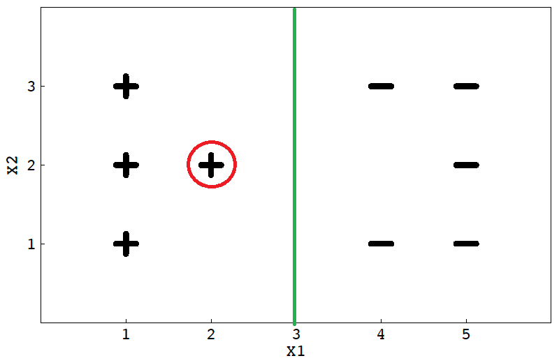
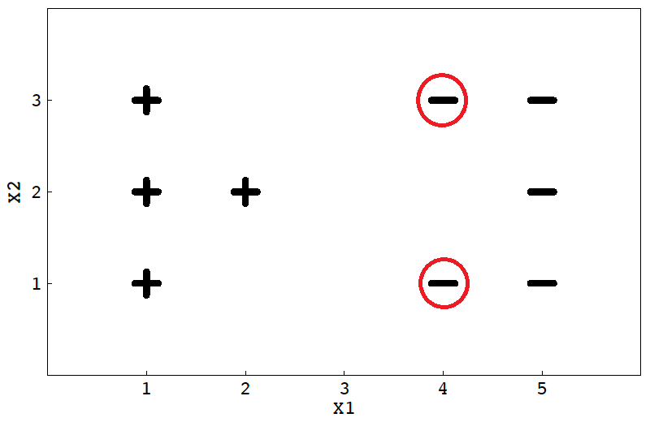

# 1
## (1)
$k_1$ and $k_2$ are kernel functions, Merver Thm: $K_1$ and $K_2$ are positive semidefinte: 

$\forall x\in \mathbb{X} = \{x_1,\ldots, x_N\}, x^TK_i x > 0 ,\;i=1,2$
therefore:
$\forall x \in \mathbb{X}: $
$$\begin{aligned}x^T K_3 x &= x^T(a_1K_1+a_2K_2)x\\
&= a_1 x^TK_1x+a_2 x^TK_2x\geq 0
\end{aligned}
$$
Using Mercer thm again, $k_3$ is a kernel function.

## (2)
assume $f(X)=[f(x_1),\ldots,f(x_N)]$
$$x^TK_4x = x^Tf(X)^Tf(X)x = (f(X)x)^Tf(X)x \geq 0$$
therefore $k_4$ is a positive definite kernel function.

# 2

|模型序号|模型 |偏差 |方差|
| -------- | -------- | -------- |-----|
|（1）| 在线性回归模型中增加权重的正则化项|增大|减小|
|（2）|对决策树进行剪枝处理|增大|减小|
|（3）| 增加神经网络中隐含层节点的个数|减少|增加|
|（4）| 去除支持向量机中所有的非支持向量|不变|不变|

# 3
## (1)
$$\min_{w,b,\xi_i}\; \frac{1}{2} \|w\|^2 +C \sum_{i=1}^{\tilde m}\xi_i +Ck \sum_{i=\tilde m+1}^m \xi_i\\ 
\begin{aligned}  \text{subject to} \quad &y_i(w^Tx_i+b)\geq 1-\xi_i \\&\xi_i \geq 0,\; i=1,\ldots, m\end{aligned}$$
其中 $i = 1,\ldots,\tilde m$ 为正例，$i = \tilde m+1,\ldots, m$ 为反例。

## (2)
Lagranian:
$$
L(w,b,\alpha, \xi , \mu) = \frac{1}{2} \|w\|^2 +C \sum_{i=1}^{\tilde m}\xi_i +Ck \sum_{i=\tilde m+1}^m \xi_i +\sum_{i=1}^m \alpha_i (1-\xi_i - y_i(w^Tx_i+b))- \sum_{i=1}^m\mu_i\xi_i
$$
$\frac{\partial L}{\partial w}=0,\; \frac{\partial L}{\partial b}=0,\;\frac{\partial L}{\partial \xi_i}=0$
$$\begin{aligned}
w &=\sum_{i=1}^m \alpha_i y_i x_i\\
0 &=\sum_{i=1}^m\alpha_i y_i\\
C &= \alpha_i +\mu_i & i =1,\ldots,\tilde{m}\\
kC &= \alpha_i +\mu_i & i =\tilde{m}+1,\ldots,m
\end{aligned}$$
dual problem:
$$
\max _\alpha \sum_{i=1}^m\alpha_i -\frac{1}{2}\sum_{i=1}^m\sum_{j=1}^m \alpha_i\alpha_j y_i y_j x_i^T x_j\\
\begin{aligned}
\text{subject to}\quad  & \sum_{i=1}^m\alpha_i y_i = 0\\
& 0\leq \alpha_i\leq C,\quad i = 1,\ldots, \tilde{m}\\
& 0\leq \alpha_i\leq kC,\quad i = \tilde{m}+1,\ldots, m\\
\end{aligned}
$$
KKT:
$$
\begin{array}{l}
\alpha_i \geq 0, \quad \mu_i \geq 0 \\
y_i f(x_i) - 1 + \xi_i \geq 0 \\
\alpha_i (y_i f(x_i) - 1 + \xi_i) = 0 \\
\xi_i \geq 0, \quad \mu_i \xi_i = 0
\end{array}
$$

# 4
## (1)

将在 $x_1 =3$直线上，$C$很大的时候对错误的容忍度降低，将会强制划分。
## (2)
去掉 $x_1 = 2$ 或者$x_1 = 4$ 上的任一点都会得到新的决策边界，因为它距离边界很近，对边界影响很大。
## (3)

同样的，在边界附近的点对边界影响很大。
## (4)
1. 使用3中不同的惩罚系数。
2. 对样本预处理，欠采样；如对多一部分做剔除；过采样；对少的一部分做插值等。
3. 忽略部分非支持向量，保证支持向量数量尽可能的一致。
## (5)
$$\begin{aligned}
\|\phi(x)-\phi(z)\| &= \sqrt{<\phi(x)-\phi(z),\phi(x)-\phi(z)>}\\
&=\sqrt{<\phi(x),\phi(x)> + <\phi(z),\phi(z)> -2<\phi(x),\phi(z)>}\\
&=\sqrt{K(x,x)+K(z,z)-2K(x,z)}
\end{aligned}
$$

# 5
$$f(x|\theta) = 
\begin{cases} 
\frac{1}{\pi\theta^2} & \|x\| \leq \theta \\ 
0 & \text{otherwise} 
\end{cases}\\
L(\theta) = \prod_{i=1}^n f(X|\theta) = \prod_{i=1}^n \frac{1}{\pi\theta^2}\\
\text{s.t.}\quad \max\|X_i\|\leq \theta$$
log:
$$
\ell(\theta) = \ln L = -2n\ln(\frac{1}{\pi})\ln\theta\\\text{s.t.}\quad \max\|X_i\|\leq \theta$$
$\max \;\ell$ we get:
$$\hat\theta =  \max(\|X_i\|)$$

# 6
## (1)
Using naive Bayes classifier
$$
P(y=1) = \frac{3}{5}\\
P(y=0) = \frac{2}{5}\\
P(x_1 = 1| y=1) = \frac{2}{3}\\
P(x_1 = 1| y=0) = \frac{1}{2}\\
P(x_2 = 1| y=1) = \frac{1}{3}\\
P(x_2 = 1| y=0) = \frac{1}{2}\\
P(x_3 = 0| y=1) = 0\\
P(x_3 = 0| y=0) = \frac{1}{2}\\
P(x_4 = 1| y=1) = \frac{2}{3}\\
P(x_4 = 1| y=0) = \frac{1}{2}\\
$$

$$
\begin{aligned}
P&\{y=1|x=(1,1,0,1)\} \\
&=\frac{1}{p(x)}p(y=1)P(x_1 = 1| y=1)P(x_2 = 1| y=1)P(x_3 = 0| y=1)P(x_4 = 1| y=1)\\
&=2^4\cdot \frac{3}{5}\cdot\frac{2}{3}\cdot\frac{1}{3}\cdot0\cdot\frac{2}{3}\\&=0
\end{aligned}
\\
\begin{aligned}
P&\{y=0|x=(1,1,0,1)\}\\
&=\frac{1}{p(x)}P(y=0)P(x_1 = 1| y=0)P(x_2 = 1| y=0)P(x_3 = 0| y=0)P(x_4 = 1| y=0)\\
&=2^4\cdot\frac{2}{5}\cdot\frac{1}{2}\cdot\frac{1}{2}\cdot\frac{1}{2}\cdot\frac{1}{2}\\
&=\frac{2}{5}
\end{aligned}
$$
## (2)\
经过Laplacian Correction：
$$
P(y=1) = \frac{4}{7}\\
P(y=0) = \frac{3}{7}\\
P(x_1 = 1| y=1) = \frac{3}{5}\\
P(x_1 = 1| y=0) = \frac{2}{4}\\
P(x_2 = 1| y=1) = \frac{2}{5}\\
P(x_2 = 1| y=0) = \frac{2}{4}\\
P(x_3 = 0| y=1) = \frac{1}{5}\\
P(x_3 = 0| y=0) = \frac{2}{4}\\
P(x_4 = 1| y=1) = \frac{3}{5}\\
P(x_4 = 1| y=0) = \frac{2}{4}\\
$$
$$
\begin{aligned}
P&\{y=1|x=(1,1,0,1)\} \\
&=\frac{1}{p(x)}p(y=1)P(x_1 = 1| y=1)P(x_2 = 1| y=1)P(x_3 = 0| y=1)P(x_4 = 1| y=1)\\
&=\frac{1}{p(x)}\cdot \frac{4}{7}\cdot\frac{3}{5}\cdot\frac{2}{5}\cdot\frac{1}{5}\cdot \frac{3}{5}\\
&=\frac{0.016}{p(x)}
\end{aligned}
\\
\begin{aligned}
P&\{y=0|x=(1,1,0,1)\}\\
&=\frac{1}{p(x)}P(y=0)P(x_1 = 1| y=0)P(x_2 = 1| y=0)P(x_3 = 0| y=0)P(x_4 = 1| y=0)\\
&=\frac{1}{p(x)}\cdot\frac{3}{7}\cdot\frac{2}{4}\cdot\frac{2}{4}\cdot\frac{2}{4}\cdot\frac{2}{4}\\
&=\frac{0.026}{p(x)}
\end{aligned}
$$

# 7